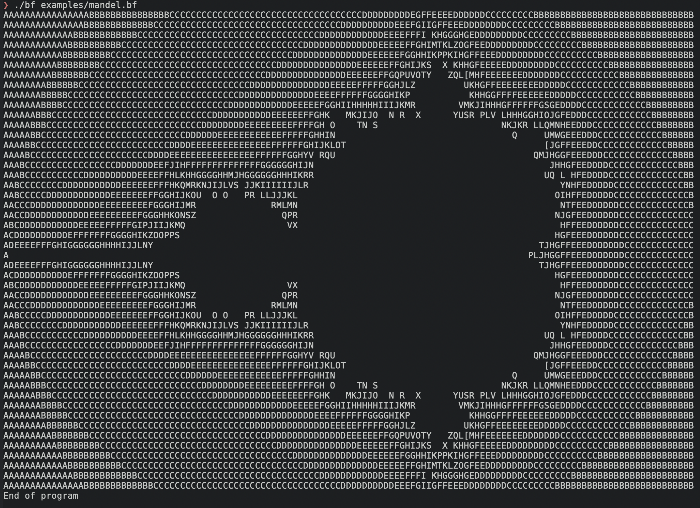

# Brainfuck interpreter in C



This is an interpreter for Brainfuck I wrote in an evening in C.

See the Mandelbrot set with

```ShellSession
$ nix run github:siraben/bf <(curl -s https://raw.githubusercontent.com/erikdubbelboer/brainfuck-jit/master/mandelbrot.bf)
```

## Building
With Nix, run `nix build github:siraben/bf`.

```ShellSession
$ gcc -O2 -o bf bf.c
```

## Tested Programs
- Mandelbrot set
- Hello world
- ROT13
- [Lost Kingdom](https://github.com/rdebath/LostKingdom) (text
  adventure game)
